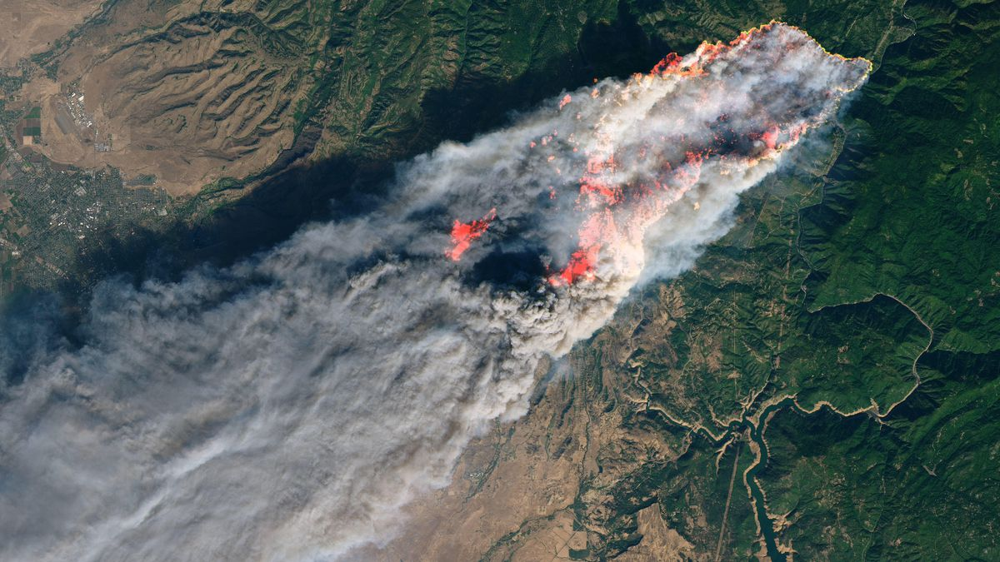
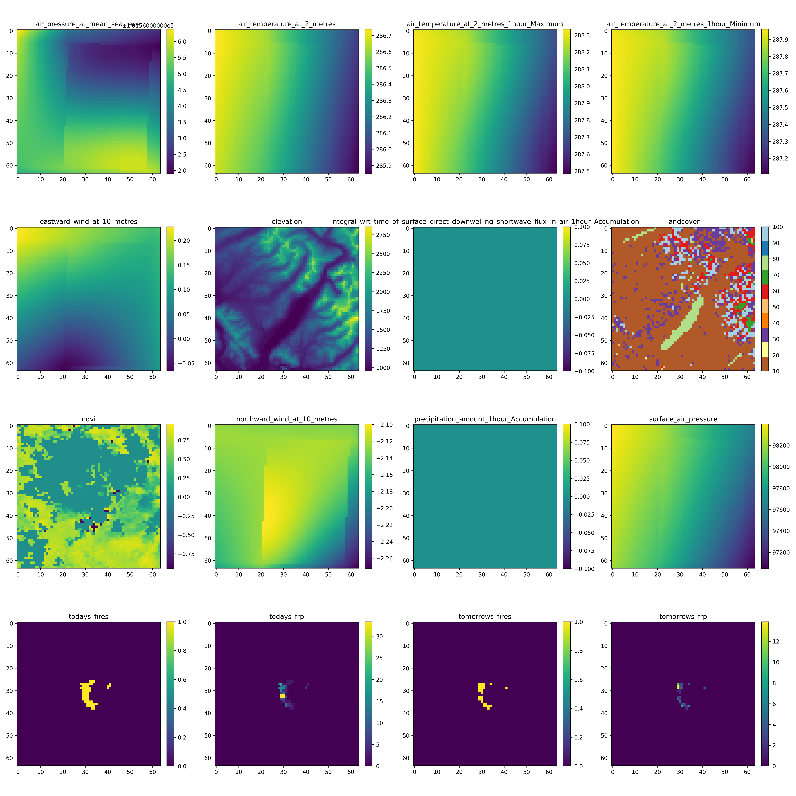
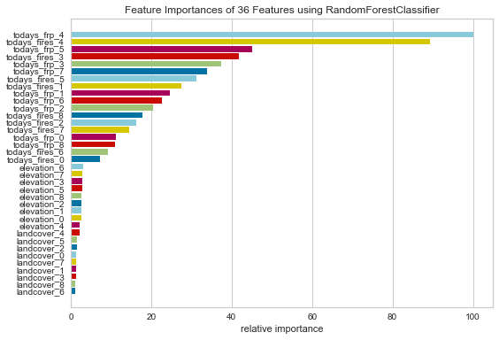
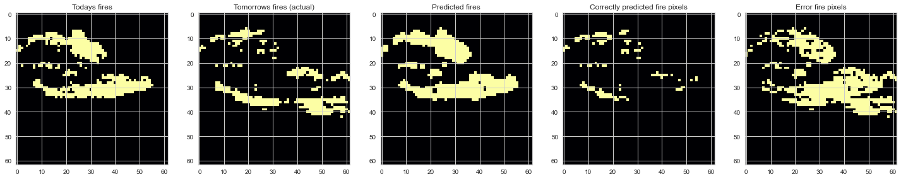
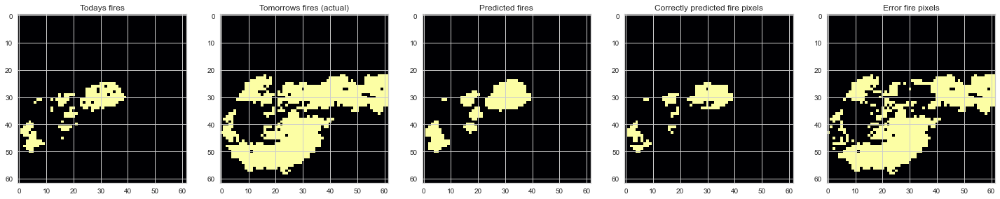
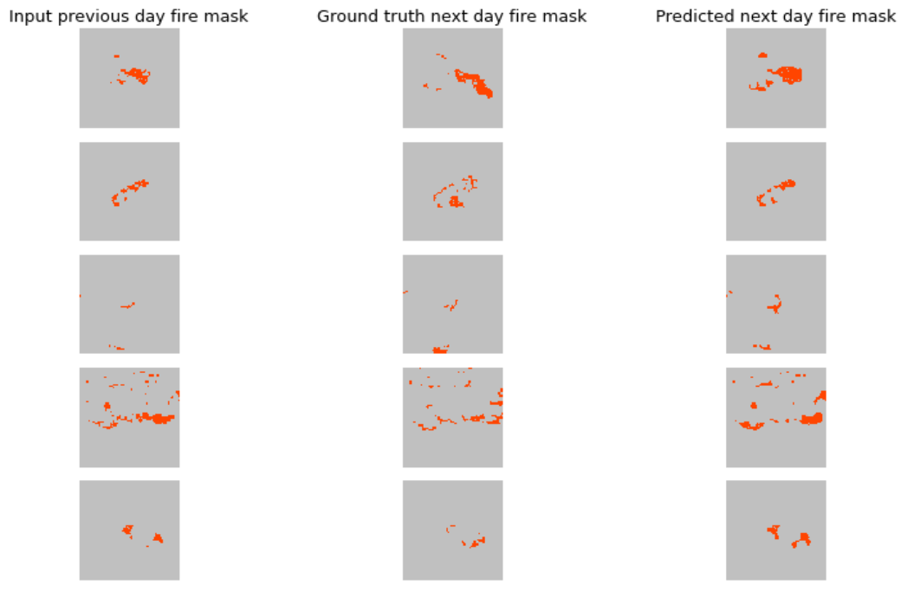
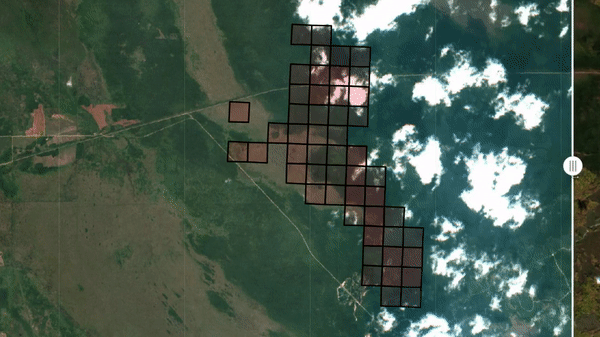
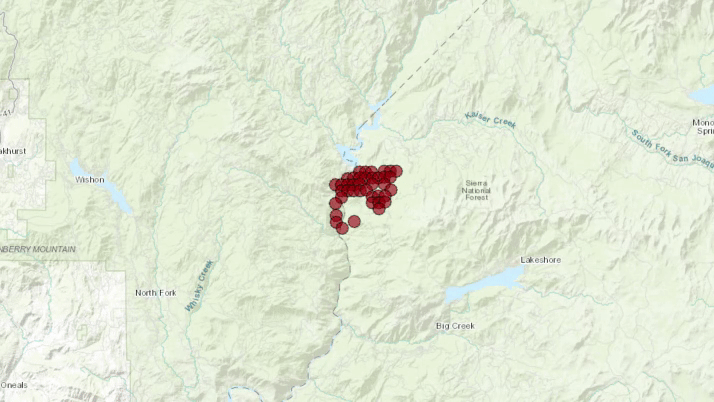

# Global fire spread prediction system
[SatelliteVu](https://www.satellitevu.com/) submission for the [AWS Disaster Response Hackathon](https://awsdisasterresponse.devpost.com/) 

**Elevator pitch:** The tech team at Satellite Vu applied our knowledge of wildfires, satellite imagery and machine learning to demonstrate a fire spread prediction system which could be applied globally using open data. 

## About the project

For this challenge, the tech team at Satellite Vu applied our knowledge of wildfires, satellite imagery and machine learning to demonstrate a fire spread prediction system. Satellites offer wide area coverage in near real time, and can access even the most remote locations. Accurate prediction of fire spread could improve disaster response, for example to identify towns or properties in the greatest immediate risk. We used data from the MODIS and VIIRS satellite sensors, which provide long-term observational records in multiple spectral bands, as well as elevation and land cover data to make predictions with both traditional machine learning and deep learning models. The models predicted the next day's fire pattern with higher precision and recall than the baseline model of fire persistence. The use of the predictions in an application which could be used by fire management teams was also demonstrated. In future we hope that Satellite Vu’s high-resolution thermal imagery could be input to models such as these to provide even more spatially accurate fire spread predictions to help them pinpoint specific populations and areas at risk.
We would also like to highlight that this work is done as a team challenge in a two-week sprint.

Above: Landsat 8 satellite image of the [Camp Fire](https://en.wikipedia.org/wiki/Camp_Fire_(2018)) on Nov. 8 2018

## Dataset preparation
Data sources are mostly from the [Registry of Open Data on AWS](https://registry.opendata.aws/), apart from the NASA-FIRMS open data which requires an account to access the data:

| Data source                                                        | Description                                                                                                                                                                                                                                                            |
|--------------------------------------------------------------------|------------------------------------------------------------------------------------------------------------------------------------------------------------------------------------------------------------------------------------------------------------------------|
| [Copernicus DEM](https://registry.opendata.aws/copernicus-dem/)    | Digital Surface Model (DSM) which represents the surface of the Earth including buildings, infrastructure and vegetation.                                                                                                                                              |
| [MODIS](https://registry.opendata.aws/modis/)                      | The Moderate Resolution Imaging Spectroradiometer (MODIS) MCD43A4 Version 6 Nadir Bidirectional Reflectance Distribution Function (BRDF)-Adjusted Reflectance (NBAR) dataset is produced daily using 16 days of Terra and Aqua MODIS data at 500 meter (m) resolution. |
| [ESA Land Cover](https://registry.opendata.aws/esa-worldcover/)    | The European Space Agency (ESA) WorldCover is a global land cover map with 11 different land cover classes produced at 10m resolution based on combination of both Sentinel-1 and Sentinel-2 data.                                                                     |
| [ERA5 Atmospheric data](https://registry.opendata.aws/ecmwf-era5/) | ERA5 is the fifth generation of ECMWF atmospheric reanalyses of the global climate, and the first reanalysis produced as an operational service.                                                                                                                       |
| [FIRMS active fire data](https://firms.modaps.eosdis.nasa.gov/) | The Fire Information for Resource Management System (FIRMS) distributes Near Real-Time (NRT) active fire data within 3 hours of satellite observation from the Visible Infrared Imaging Radiometer Suite (VIIRS) aboard S-NPP and NOAA 20 at 375 meter (m) resolution. |

The processing code is in the folder [dataset_preparation](https://github.com/SatelliteVu/AWS-Disaster-Response-Hackathon-submission/tree/main/dataset_preparation). For convenience the dataset has been uploaded to Kaggle at [satellite-next-day-wildfire-spread](https://www.kaggle.com/satellitevu/satellite-next-day-wildfire-spread) 

## Data quality
Data quality checks involve visualising examples of the dataset and generating descriptive statistics about each variables of dataset, such as mean and standard deviation so that the data can be normalised when required by the mode. Additionally this process should identify any anomlies or outliers in the dataset, which may require special attention. The readme in the [data_quality](https://github.com/SatelliteVu/AWS-Disaster-Response-Hackathon-submission/tree/main/data_quality) folder provides further information. These checks were important since they identified that some features contained essentially the same information (e.g. NDVI & the landcore index) and allowed us to identify which features had the best overall data quality. An example single sample of data is shown below: note that not all features were used in the final model training.

## Classical ML
Following the approach presented in the paper [Next Day Wildfire Spread: A Machine Learning Data Set to Predict Wildfire Spreading from Remote-Sensing Data](https://arxiv.org/abs/2112.02447) both logistic regression and random forest models were trained on flattened 3x3 pixel patches of imagery. This required transforming the dataset of images to a table of data in csv format, shown in the notebook `/classical_ml/create_csv.ipynb`. The processing for doing this transformation is in the notebook `classical_ml/create_csv.ipynb`. To avoid needing to copy image data locally and to conserve storage on the sagemaker instance, pixel data was accessed as numpy arrays that are hosted on [AWS S3](https://aws.amazon.com/s3/). To speed up processing [multiprocessing](https://docs.python.org/3/library/multiprocessing.html) was used, allowing all 4 cores of the sagemaker instance to be used.

The logistic regression model struggled to beat the naive baseline assumption that fires are persistent over time, whilst the random forest model achieved a significant improvement over the baseline (table below). Note that the training dataset is very imbalanced with the significant majority of pixels being `not-fire`, but we want a model with good performance on the `fire` pixels. To deal with this imbalance the `class_weight` parameter was experimented, as well as the `max_depth` of the trees. The precision and recall of the best performing model (selected for improving both these metrics over the baseline) are in the table below.

| Fire weight  | max_depth   | fire precision  | fire recall | no-fire precision  | no-fire recall |
| -----------  | ----------- | -----------     | ----------- | -----------        |    ----------- |
| Baseline     | NA          |      0.37       |    0.37     |      0.98          |     0.98       |
| 4            | 10          |      0.41       |    0.41     |      0.98          |     0.98       |

Inspection of feature importance identified the current fire location as the most significant indicator of fire spread, followed by elevation and landcover features.

Visualisation of fire predictions indicate that this simple model (based on a subset of features and 3x3 pixel patches of imagery) cannot predict significant movements of fires, but nevertheless does provide useful predictions for slow moving fires.

## Deep learning with ResUNet
Amongst several CNN model architectures tested, we selected the [ResUNet](https://arxiv.org/abs/1711.10684) as it is showed the best performance during preliminary experiments. The ResUNet performance is compared to the baseline (fire persistence).

|              | fire precision  | fire recall | no-fire precision  | no-fire recall |
| -----------  | -----------     | ----------- | -----------        | -----------    |
| Baseline     |  0.27           |    0.33     |      0.98          |     0.98       |
| ResUNet      |  0.30           |    0.44     |      0.98          |     0.97       |

The model achieves better precision and recall for the fire class than the baseline. The recall improves more significantly, which works in the favour of an application where the cost of error is higher. Note that the baseline metrics differ from the random forest values for 2 reasons: (1) in the random forest model the outermost pixels are not used and (2) the test dataset may have comprised slightly different images than those used on the random forest as a discrepancy was discovered very late in the day about the version of datasets being used by the two team members.

Visualization of some predictions (below) show that it is difficult for the model to predict big changes, and the classifications are very much dependent on the previous day fire mask that is used as input. Outputs often look like a smoothed out version of the previous day fire input feature.

Future work could include: class balancing support & version of dice coefficient compatible with class balancing, and use of AutoML pipelines to improve efficiency of model architecture and hyperparameters tests

## Fire predictions visualisation
Visualisation tools were created for demonstrating how model predictions can be used in applications.

**Fire prediction mapping on Sentinel-2 layer:** This map tool is created for visualising VIIRS fire raw data/ ML model training results being generated. We use the geojson/metadata created from pre-processing to locate the fire pixels from ML model training results. Finally, those fire pixels are plotted overlapping with the Sentinel-2 data. The tool is in notebook `fire_prediction_visualisation/split_map_s2_fire.ipynb`

**Fire prediction mapping on top of open street map:** To make sure the predicted fire information can be easily used for fire management, we created a fire warning system with an example below. You can zoom in/out to check the exactly location of fire episodes. This system will also get nearby building data from open street map and generate a warning at individual building/power station ect level for any within 10km of fire. The tool is in notebook `fire_prediction_visualisation/animation_fire_warning_using_open_street_map.ipynb` and exported to `fire_prediction_visualisation/fire_warning.html` (open in browser)

### Video

### Running notebooks
All notebooks in this repo are runnable on AWS Sagemaker Studio Lab. For the python environmnet, some people used custom environments defined using an `env.yml` file, whilst other people just installed packages into one of the supplied environments using a `requirements.txt` file.

### Languages, frameworks, platforms, APIs, & other technologies used
- Python 3 used for processing, modelling and visualisation
- Scikit learn for classical ML modelling & Yellowbrick for feature importance visualisation
- Deep learning used Keras/tensorflow
- AWS Studio Lab used for running notebooks and training ML models
- AWS S3 used for data storage
- https://firms.modaps.eosdis.nasa.gov/ for VIIRS fire data
- https://earth-search.aws.element84.com/v0/collections/sentinel-s2-l2a-cogs for Sentinel 2 images
- https://eod-catalog-svc-prod.astraea.earth/ for MODIS data
- https://registry.opendata.aws/ Registry of Open Data on AWS for all other data
- [Open Street Map API](https://www.openstreetmap.org/) (via osmnx)
- Git & github used for version control of code
- [Weights & Biases](https://wandb.ai/site) was used for tracking training metrics of the deep learning model
- [ipyleaflet](https://ipyleaflet.readthedocs.io/en/latest/) was used to create interactive maps in Jupyter notebooks
- [Zarr](https://zarr.readthedocs.io/en/stable/) is a format for the storage of chunked, compressed, N-dimensional arrays

Note that each team member had their own AWS Sagemaker Studio Lab instance & git repositories, with the results and outputs aggregated in this repo.

### Team members & their contributions
The work for this submissions was completed within a 2 week sprint, with [team members](https://www.satellitevu.com/about-us) coordinating over Slack and Zoom.

- [Ed Jeffrey](https://github.com/ej00214): data quality assurance
- [Isobel Gray](https://github.com/ijgray): scripted and voiced the video submission
- [James O'Connor](https://github.com/JamesOConnor): generated all datasets except fire dataset
- [Jade Constantinou](https://github.com/jadeconstantinou): curated and edited the video submission & provided data visualisations
- [Maria Ghironi](https://github.com/Fughir): project manager
- [Patrick Talon](https://github.com/ptalon91): training and evaluation of deep learning ResUNet model
- [Robin Cole](https://github.com/robmarkcole): trained the classical ML models and curated this repository
- [Ross Hawton](https://github.com/spatialtrail): generated the VIIRS fire dataset 
- [Tianran Zhang](https://github.com/tianranZH): wildfire scientist, created data visualisations

