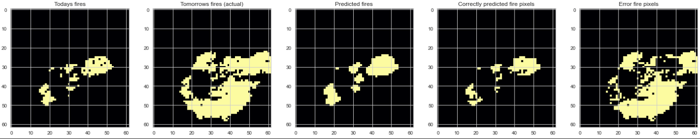
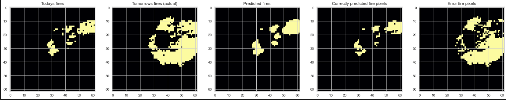
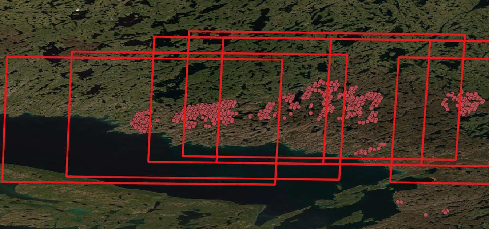

# Data Quality

Introduction
============

The features of the dataset are:

```java
['air_pressure_at_mean_sea_level',
 'air_temperature_at_2_metres',
 'air_temperature_at_2_metres_1hour_Maximum',
 'air_temperature_at_2_metres_1hour_Minimum',
 'dew_point_temperature_at_2_metres',
 'eastward_wind_at_100_metres',
 'eastward_wind_at_10_metres',
 'elevation',
 'integral_wrt_time_of_surface_direct_downwelling_shortwave_flux_in_air_1hour_Accumulation',
 'landcover',
 'lwe_thickness_of_surface_snow_amount',
 'ndvi',
 'northward_wind_at_100_metres',
 'northward_wind_at_10_metres',
 'precipitation_amount_1hour_Accumulation',
 'sea_surface_temperature',
 'snow_density',
 'surface_air_pressure',
 'todays_fires',
 'tomorrows_fires']
```

The list below gives explanation for some of the lesser known classes:

*   **Downwelling surface shortwave flux** (DSSF) is a key parameter to addressing many climate, meteorological, and solar energy issues. Downwelling surface shortwave flux (DSSF) is defined as the irradiance in the solar spectrum reaching the Earth’s surface per unit of surface.
    
*   **Normalized Difference Vegetation Index (NDVI)** quantifies vegetation by measuring the difference between near-infrared (which vegetation strongly reflects) and red light (which vegetation absorbs).
    
*   NDVI always ranges from -1 to +1. But there isn’t a distinct boundary for each type of land cover.
    
    For example, when you have negative values, it’s highly likely that it’s water. On the other hand, if you have an NDVI value close to +1, there’s a high possibility that it’s dense green leaves. But when NDVI is close to zero, there aren’t green leaves and it could even be an urbanized area.
    
*   The value of NDVI varied between − 1.0 and + 1.0. The mounting amount of the positive NDVI values indicates the increase in the amounts of green vegetation. The NDVI values near zero and decreasing negative values indicate non-vegetated features, such as barren surfaces (rock and soil), water, snow, ice, and clouds.
    
*   High NDVI values (approximately 0.6 to 0.9) correspond to dense vegetation such as that found in temperate and tropical forests or crops at their peak growth stage.
    
*   Do Clouds Affect NDVI? Clouds represent natural obstacles for optical satellite imagery. Thus, if satellite images are retrieved with optical satellites, clouds make a huge impact on image quality and, correspondingly, satellite-based analytics.
    
*   The common range for green vegetation is 0.2 to 0.8.
    
*   NDVI = -1 to 0 represent Water bodies. NDVI = -0.1 to 0.1 represent Barren rocks, sand, or snow. NDVI = 0.2 to 0.5 represent Shrubs and grasslands or senescing crops. NDVI = 0.6 to 1.0 represent Dense vegetation or tropical rainforest.
    
    
*   Below show some examples with the NDVI for our data. There are massive peaks at zero. Asked James - these peaks are because cloud pixels are given an NDVI of 0 in the pre-processing.
    
*   This could really affect the model - cloud/smoke could be covering the actual NDVI which could be thick forest. An NDVI of zero is barren rock or sand. If an area has an NDVI of zero, the fire shouldn’t spread there because there is no vegetation. Therefore, this could confuse the model.
    
*   A cloud mask using the exact zero values in the NDVI may solve this issue.
    
*   To help model learn this feature, could discretise the NDVI - this was not carried out.
    


<table data-layout="default" data-local-id="6c230d6d-a739-433f-8faf-2338d00ec957" class="confluenceTable"><colgroup><col style="width: 374.0px;"><col style="width: 383.0px;"></colgroup><tbody><tr><th class="confluenceTh"><p style="text-align: center;"><strong>NDVI</strong></p></th><th class="confluenceTh"><p style="text-align: center;"><strong>Class</strong></p></th></tr><tr><td class="confluenceTd"><p style="text-align: center;">-1.0 &lt; NDVI &lt; -0.1</p></td><td class="confluenceTd"><p style="text-align: center;">Water</p></td></tr><tr><td class="confluenceTd"><p style="text-align: center;">-0.1 &lt; NDVI &lt; 0.1</p></td><td class="confluenceTd"><p style="text-align: center;">Rock, Snow, Urban</p></td></tr><tr><td class="confluenceTd"><p style="text-align: center;">0.1 &lt; NDVI &lt; 0.5</p></td><td class="confluenceTd"><p style="text-align: center;">Grasslands, Crops</p></td></tr><tr><td class="confluenceTd"><p style="text-align: center;">0.5 &lt; NDVI &lt; 1.0</p></td><td class="confluenceTd"><p style="text-align: center;">Dense Vegetation</p></td></tr></tbody></table>

*   **Land cover** is a map with 10 classes, each a different type of environment/land use.
    
*   Explanation of land cover is given at: [WorldCover\_PUM\_V1.0.pdf (esa-worldcover.s3.amazonaws.com)](https://esa-worldcover.s3.amazonaws.com/v100/2020/docs/WorldCover_PUM_V1.0.pdf).
    

<table data-layout="default" data-local-id="a37e8785-8c26-4337-8def-dc25adc9694f" class="confluenceTable"><colgroup><col style="width: 340.0px;"><col style="width: 340.0px;"></colgroup><tbody><tr><th class="confluenceTh"><p style="text-align: center;"><strong>Map Code</strong></p></th><th class="confluenceTh"><p style="text-align: center;"><strong>Land Cover Class</strong></p></th></tr><tr><td class="confluenceTd"><p style="text-align: center;">10</p></td><td class="confluenceTd"><p style="text-align: center;">Tree cover</p></td></tr><tr><td class="confluenceTd"><p style="text-align: center;">20</p></td><td class="confluenceTd"><p style="text-align: center;">Shrubland</p></td></tr><tr><td class="confluenceTd"><p style="text-align: center;">30</p></td><td class="confluenceTd"><p style="text-align: center;">Grassland</p></td></tr><tr><td class="confluenceTd"><p style="text-align: center;">40</p></td><td class="confluenceTd"><p style="text-align: center;">Cropland</p></td></tr><tr><td class="confluenceTd"><p style="text-align: center;">50</p></td><td class="confluenceTd"><p style="text-align: center;">Built-up</p></td></tr><tr><td class="confluenceTd"><p style="text-align: center;">60</p></td><td class="confluenceTd"><p style="text-align: center;">Sparse vegetation</p></td></tr><tr><td class="confluenceTd"><p style="text-align: center;">70</p></td><td class="confluenceTd"><p style="text-align: center;">Snow and Ice</p></td></tr><tr><td class="confluenceTd"><p style="text-align: center;">80</p></td><td class="confluenceTd"><p style="text-align: center;">Herbaceous wetland</p></td></tr><tr><td class="confluenceTd"><p style="text-align: center;">90</p></td><td class="confluenceTd"><p style="text-align: center;">Mangroves</p></td></tr><tr><td class="confluenceTd"><p style="text-align: center;">100</p></td><td class="confluenceTd"><p style="text-align: center;">Moss and Lichen</p></td></tr></tbody></table>

*   The figure below gives an example of the landcover and NDVI for one of the samples (with sample number 4328).
    
*   In the landcover plot, the green is sparse vegetation, the orange is cropland and the red is urban areas.
    
*   The NDVI figure shows its usefulness at showing vegetation (and possible burning areas).
    
*   The cropland (orange) areas correlate strongly with the high NDVI (>0.5) values.
    
*   This is because cropland is the only vegetation (and therefore burnable) section in the sample.
    
*   The sparse vegetation (green) and urban areas (red) have lower NDVI values (~0.0-0.1). This would correspond to the probability of impeding fire growth.
    


Example Samples
===============

Below are three examples of samples in the dataset; 16 features are plotted. 5 of the features are removed: `dew_point_temperature_at_2_metres`, `eastward_wind_at_100_metres`, `lwe_thickness_of_surface_snow_amount`, `northward_wind_at_100_metres`, `snow_density`.

Sample 1
--------

*   The first sample has sample number 10091. Some of the atmospheric features have **artefacts**. This is because the atmospheric data has huge pixels, so the artefacts are due to the resampling to 500 m.
    


Sample 2
--------


Sample 3
--------


Some Unexpected NaNs
====================

*   As the feature statistics table will show (in the nan count column), there are some data which contain nan values.
    
*   Here is the `air_pressure_at_mean_sea_level` data for sample number `10021`.
    
*   The whole image is nan values.
    
*   The feature statistics table in the next section quantifies the number of nan values for each feature. It shows that the majority of the features contain a very small percentage of nan values (<~0.5%)
    


Feature Statistics Table
========================

Below is a list of unexpected values in the statistics for the dataset.

*   Negative surface direct downwelling shortwave flux?
    
*   Very low values for minimum air temperature (-37 degrees celsius).
    
*   Negative thickness for snow amount?
    
*   Negative precipitation amount?
    
*   The units for the features were found at this link: [ERA5: data documentation - Copernicus Knowledge Base - ECMWF Confluence Wiki](https://confluence.ecmwf.int/display/CKB/ERA5%3A+data+documentation#ERA5:datadocumentation-Parameterlistings)
    

<table data-layout="wide" data-local-id="a5abeb25-ed84-4bf8-a07b-803ff4b5109d" class="confluenceTable"><colgroup><col style="width: 356.0px;"><col style="width: 73.0px;"><col style="width: 113.0px;"><col style="width: 124.0px;"><col style="width: 113.0px;"><col style="width: 90.0px;"><col style="width: 91.0px;"></colgroup><tbody><tr><td class="confluenceTd"><p style="text-align: center;"></p></td><td class="confluenceTd"><p style="text-align: center;">units</p></td><td class="confluenceTd"><p style="text-align: center;">minimum</p></td><td class="confluenceTd"><p style="text-align: center;">maximum</p></td><td class="confluenceTd"><p style="text-align: center;">sum</p></td><td class="confluenceTd"><p style="text-align: center;">mean</p></td><td class="confluenceTd"><p style="text-align: center;">nan count</p></td></tr><tr><td class="confluenceTd"><p style="text-align: center;">air_pressure_at_mean_sea_level</p></td><td class="confluenceTd"><p style="text-align: center;">Pa</p></td><td class="confluenceTd"><p style="text-align: center;">98291.073</p></td><td class="confluenceTd"><p style="text-align: center;">105551.8</p></td><td class="confluenceTd"><p style="text-align: center;">1.087E+13</p></td><td class="confluenceTd"><p style="text-align: center;">101113.5</p></td><td class="confluenceTd"><p style="text-align: center;">399578.3</p></td></tr><tr><td class="confluenceTd"><p style="text-align: center;">air_temperature_at_2_metres</p></td><td class="confluenceTd"><p style="text-align: center;">Pa</p></td><td class="confluenceTd"><p style="text-align: center;"><span style="color: rgb(255,196,0);">233.4543</span></p></td><td class="confluenceTd"><p style="text-align: center;">308.41759</p></td><td class="confluenceTd"><p style="text-align: center;">3.076E+10</p></td><td class="confluenceTd"><p style="text-align: center;">285.9932</p></td><td class="confluenceTd"><p style="text-align: center;">8188.393</p></td></tr><tr><td class="confluenceTd"><p style="text-align: center;">air_temperature_at_2_metres_1hour_Maximum</p></td><td class="confluenceTd"><p style="text-align: center;">K</p></td><td class="confluenceTd"><p style="text-align: center;"><span style="color: rgb(255,196,0);">232.28178</span></p></td><td class="confluenceTd"><p style="text-align: center;">308.43747</p></td><td class="confluenceTd"><p style="text-align: center;">3.085E+10</p></td><td class="confluenceTd"><p style="text-align: center;">286.9071</p></td><td class="confluenceTd"><p style="text-align: center;">7987.091</p></td></tr><tr><td class="confluenceTd"><p style="text-align: center;">air_temperature_at_2_metres_1hour_Minimum</p></td><td class="confluenceTd"><p style="text-align: center;">K</p></td><td class="confluenceTd"><p style="text-align: center;"><span style="color: rgb(255,196,0);">231.46024</span></p></td><td class="confluenceTd"><p style="text-align: center;">307.62498</p></td><td class="confluenceTd"><p style="text-align: center;">3.081E+10</p></td><td class="confluenceTd"><p style="text-align: center;">286.4471</p></td><td class="confluenceTd"><p style="text-align: center;">8045.231</p></td></tr><tr><td class="confluenceTd"><p style="text-align: center;">eastward_wind_at_10_metres</p></td><td class="confluenceTd"><p style="text-align: center;">ms-1</p></td><td class="confluenceTd"><p style="text-align: center;">-11.5388</p></td><td class="confluenceTd"><p style="text-align: center;">11.252938</p></td><td class="confluenceTd"><p style="text-align: center;">8441819.3</p></td><td class="confluenceTd"><p style="text-align: center;">0.078487</p></td><td class="confluenceTd"><p style="text-align: center;">4382.893</p></td></tr><tr><td class="confluenceTd"><p style="text-align: center;">elevation</p></td><td class="confluenceTd"><p style="text-align: center;">m</p></td><td class="confluenceTd"><p style="text-align: center;">-41.75213</p></td><td class="confluenceTd"><p style="text-align: center;">4355.983</p></td><td class="confluenceTd"><p style="text-align: center;">9.471E+10</p></td><td class="confluenceTd"><p style="text-align: center;">880.306</p></td><td class="confluenceTd"><p style="text-align: center;">4356310</p></td></tr><tr><td class="confluenceTd"><p style="text-align: center;">integral_downwelling_flux_in_air_1hour</p></td><td class="confluenceTd"><p style="text-align: center;">-</p></td><td class="confluenceTd"><p style="text-align: center;"><span style="color: rgb(255,196,0);">-13.96094</span></p></td><td class="confluenceTd"><p style="text-align: center;">1747004.9</p></td><td class="confluenceTd"><p style="text-align: center;">7.28E+12</p></td><td class="confluenceTd"><p style="text-align: center;">67677.82</p></td><td class="confluenceTd"><p style="text-align: center;">56654718</p></td></tr><tr><td class="confluenceTd"><p style="text-align: center;">landcover</p></td><td class="confluenceTd"><p style="text-align: center;">-</p></td><td class="confluenceTd"><p style="text-align: center;">10</p></td><td class="confluenceTd"><p style="text-align: center;">100</p></td><td class="confluenceTd"><p style="text-align: center;">2.758E+09</p></td><td class="confluenceTd"><p style="text-align: center;">25.63552</p></td><td class="confluenceTd"><p style="text-align: center;">539568.3</p></td></tr><tr><td class="confluenceTd"><p style="text-align: center;">ndvi</p></td><td class="confluenceTd"><p style="text-align: center;">-</p></td><td class="confluenceTd"><p style="text-align: center;">-1</p></td><td class="confluenceTd"><p style="text-align: center;">1</p></td><td class="confluenceTd"><p style="text-align: center;">47946578</p></td><td class="confluenceTd"><p style="text-align: center;">0.450878</p></td><td class="confluenceTd"><p style="text-align: center;">5142.47</p></td></tr><tr><td class="confluenceTd"><p style="text-align: center;">northward_wind_at_10_metres</p></td><td class="confluenceTd"><p style="text-align: center;">ms-1</p></td><td class="confluenceTd"><p style="text-align: center;">-10.71024</p></td><td class="confluenceTd"><p style="text-align: center;">9.7686046</p></td><td class="confluenceTd"><p style="text-align: center;">-72210487</p></td><td class="confluenceTd"><p style="text-align: center;">-0.67124</p></td><td class="confluenceTd"><p style="text-align: center;">4463.459</p></td></tr><tr><td class="confluenceTd"><p style="text-align: center;">precipitation_amount_1hour_Accumulation</p></td><td class="confluenceTd"><p style="text-align: center;">m</p></td><td class="confluenceTd"><p style="text-align: center;"><span style="color: rgb(255,196,0);">-0.000194</span></p></td><td class="confluenceTd"><p style="text-align: center;">0.0121032</p></td><td class="confluenceTd"><p style="text-align: center;">5920.0922</p></td><td class="confluenceTd"><p style="text-align: center;">5.50E-05</p></td><td class="confluenceTd"><p style="text-align: center;">0.342615</p></td></tr><tr><td class="confluenceTd"><p style="text-align: center;">surface_air_pressure</p></td><td class="confluenceTd"><p style="text-align: center;">Pa</p></td><td class="confluenceTd"><p style="text-align: center;">50044.061</p></td><td class="confluenceTd"><p style="text-align: center;">103529.65</p></td><td class="confluenceTd"><p style="text-align: center;">1.026E+13</p></td><td class="confluenceTd"><p style="text-align: center;">95401.67</p></td><td class="confluenceTd"><p style="text-align: center;">7031786</p></td></tr><tr><td class="confluenceTd"><p style="text-align: center;">todays_fires</p></td><td class="confluenceTd"><p style="text-align: center;">-</p></td><td class="confluenceTd"><p style="text-align: center;">0</p></td><td class="confluenceTd"><p style="text-align: center;">1</p></td><td class="confluenceTd"><p style="text-align: center;">3336848</p></td><td class="confluenceTd"><p style="text-align: center;">0.031013</p></td><td class="confluenceTd"><p style="text-align: center;">4089.547</p></td></tr><tr><td class="confluenceTd"><p style="text-align: center;">todays_frp</p></td><td class="confluenceTd"><p style="text-align: center;">W</p></td><td class="confluenceTd"><p style="text-align: center;">0</p></td><td class="confluenceTd"><p style="text-align: center;">3994.28</p></td><td class="confluenceTd"><p style="text-align: center;">65233662</p></td><td class="confluenceTd"><p style="text-align: center;">0.606277</p></td><td class="confluenceTd"><p style="text-align: center;">150783.8</p></td></tr><tr><td class="confluenceTd"><p style="text-align: center;">tomorrows_fires</p></td><td class="confluenceTd"><p style="text-align: center;">-</p></td><td class="confluenceTd"><p style="text-align: center;">0</p></td><td class="confluenceTd"><p style="text-align: center;">1</p></td><td class="confluenceTd"><p style="text-align: center;">2525092</p></td><td class="confluenceTd"><p style="text-align: center;">0.023468</p></td><td class="confluenceTd"><p style="text-align: center;">3196.706</p></td></tr><tr><td class="confluenceTd"><p style="text-align: center;">tomorrows_frp</p></td><td class="confluenceTd"><p style="text-align: center;">W</p></td><td class="confluenceTd"><p style="text-align: center;">0</p></td><td class="confluenceTd"><p style="text-align: center;">3254.17</p></td><td class="confluenceTd"><p style="text-align: center;">43377047</p></td><td class="confluenceTd"><p style="text-align: center;">0.403137</p></td><td class="confluenceTd"><p style="text-align: center;">98836.23</p></td></tr></tbody></table>

*   Sum (todays\_fires) = 3336848 Average Fire Pixels per Image = 3336848/26268 = 127 pixels
    
*   Sum (tomorrows\_fires) = 2525092 Average Fire Pixels per Image = 2525092/26268 = 96 pixels
    
*   The average fire size the preceding day is 25% smaller than on the previous day.
    

Feature Histograms
==================

*   It has been found, through a few of the early training attempts, that some of the features are less important for the model to predict the next day fire spread.
    
*   The important features are listed below with their histogram distributions for their mean, maximum and minimum pixel values for all 26268 samples.
    
*   Below we go through the histograms for a selection of features, most being important and also an example of one feature that is not important - precipitation amount.
    

Elevation
---------

*   The histogram of mean, maximum and minimum pixel elevation values for all the samples is given below.
    
*   The maximum elevation in North America is 6190 metres - Mount Denali in Alaska. This means that the range of elevations in the dataset seem very reasonable.
    
*   The firemap figure below shows some of the data in the dataset (for 2018). The fires are concentrated in some specific areas, e.g. British Colombia.
    
*   The average elevation for North America is 672 m. Seeming that the majority of the wildfires are in higher elevation areas, it’s no surprise that there are quite a lot of images with maximum elevation values from 1500 - 3000 meters.
    


NDVI
----

*   The NDVI ranges from -1 to 1.
    
*   The histogram below shows that the NDVI adheres to these bounds in our dataset.
    
*   There is a peak of values for -1 and 0 for the minimum pixel value and +1 for the maximum pixel value. The -1 peak is because of water, which has a very low NDVI (of around -1) and therefore a lot of the minimum pixel values are -1. If there is no water in a scene, and the majority of the pixels are lush forest, then the lowest value would likely be 0 - especially seeing that `nan` values due to clouds/smoke were made to be zero. Then, the maximum value for NDVI is 1.0 which relates to very lush and dense forests.
    


Minimum Air Temperature at 2 Meters
-----------------------------------

*   The minimum air temperature in the entire dataset is 231.5 K (-41.7 degrees Celsius ) and the highest temperature is 307.6 K (- 34.45 degrees Celsius). The mean is 286.4 K (13.3 degrees Celsius)
    
*   The highest temperature seems reasonable. The mean value falls close to the average worldwide temperature of ~15 degrees Celsius.
    
*   The lowest temperature of - 34.45 degrees Celsius seems pretty low.
    
*   It was expected that this was due to a high elevation, however upon further inspection this was not the case.
    
*   The lowest temperature pixel (231.5 K) belongs to **sample number** **17678**, which has a maximum elevation of 57.3 metres.
    
*   This same sample has a mean surface air pressure value of 54353 Pa, this type of low pressure corresponds to an elevation of 4400 metres above sea level. However, the sample has a much lower elevation.
    


Surface Air Pressure
--------------------

*   The mean surface air pressure pixel value is 95400 Pa, with the mode being ~100,000 Pa.
    
*   Surface pressure at sea level is 101,000 Pa.
    
*   It would be expected for the average surface pressure to be slightly lower, due to the mean elevation being hundreds of meters above sea level.
    
*   The small peak of low surface air pressures at 50000 - 60000 Pa is likely due to some of the samples being in very mountainous areas. This low pressure corresponds to an elevation of 4200 - 5500 m.
    
*   The maximum elevation in the dataset is 4355 m - this falls within this range.
    


1 Hour Accumulation of Precipitation
------------------------------------

*   This feature histogram is shown as a sanity check.
    
*   For a forest fire, it would be expected that the accumulated precipitation in the area would be very low.
    
*   Otherwise, why would there be a forest fire?
    
*   The histogram shows that the overwhelming majority of the images have zero precipitation, and a very small fraction have very low amounts.
    
*   This us as expected
    


Land Cover
----------

*   The majority (>90%) of the mean pixel values for the land cover in the samples fall in the range 10 - 40.
    
*   Land Cover = 10, Tree cover
    
*   Land Cover = 20, Shrubland
    
*   Land Cover = 30, Grassland
    
*   Land Cover = 40, Cropland
    
*   There’s a small number with 50, 60 - Built-up, sparse vegetation.
    
*   It can be assumed that 10-40 would be pixels where the wildfire could spread - as they are burnable bio-materials. Whereas, 50-100 would impede the fire spread.
    
*   This shows that there is a large class imbalance between pixels where the fire could possibly spread and pixels where the fire cannot.
    


Firemasks
=========

*   Below shows some of the todays fires and corresponding tomorrows fires masks. Out of a random sample of 10 of the samples, it seems two of them contain empty tomorrows fires - the wildfire has been extinguished.
    
*   This type of data is not useful for training on - it doesn't constitute as wildfire spread.
    
*   Therefore, the 26267 samples were filtered to exclude samples where the ‘todays fires' mask and 'tomorrows fires’ mask contained less than 5 pixels of fire.
    
*   This left 21661 samples where there was sufficiently sized fire in both masks.
    
*   This means that ~20% of the images were removed.
    


Some Overlapping Samples
========================

*   Some samples have been discovered as very similar.
    
*   These below figures show the today and tomorrow fires as well as the prediction for the traditional machine learning model (carried out by Robin).
    
*   Each figure shows a very similar input for today/tomorrow fires.
    
*   The sample numbers for these images are: 5480, 5481 & 5482
    
*   It was also discovered that samples with number 5518, 5519 & 5523 were also very similar.
    



*   These repeating images could easily be split between the test/train/validation sets of images for the DL model.
    
*   This could cause overfitting and inaccurate accuracy predictions.
    
*   **Solution** - use GeoPandas function `overlap` to find out which chips are overlapping. If a series of images are found to be overlapping (on a specific date), then only the first one is added to the training dataset.
