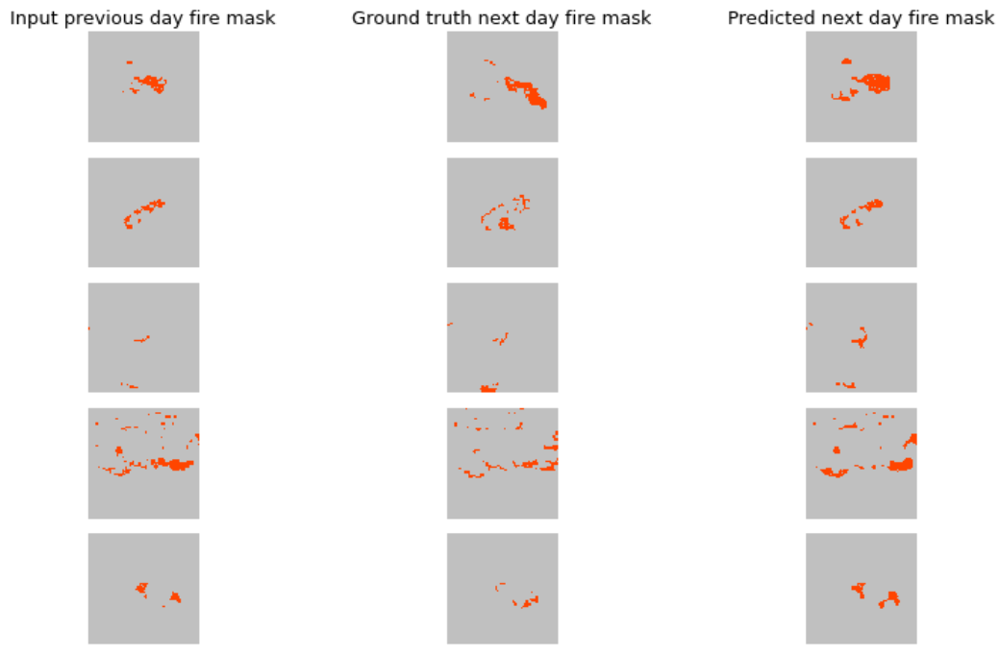

## Dataset preparation
For deep learning model training, the dataset is converted to TFRecords files, that can be used with Tensorflow to train deep learning models efficiently. The TFRecords are randomly split approximately into three subsets for model training (80%), validation (10%) and testing (10%). We use the following features as inputs to train the model:

- Elevation
- Previous day’s Fire Radiative Power
- Previous day’s fire mask

The target output is the next day’s fire mask.

## Model training
Amongst several model architectures tested, we selected the [ResUNet](https://arxiv.org/abs/1711.10684) as it showed the best performance during preliminary experiments. The loss function which provided best results is the dice coefficient loss function, which usually works well with imbalanced semantic segmentation tasks. The Adam optimizer is here used with a learning rate of `0.0001`. We use TensorFlow data generator to stream batches of data during training. The data generators are responsible for reading and pre-processing the data from the TFRecords on the fly during training. The input features are clipped to minimum and maximum values, and rescaled according to descriptive statistics generated during the data quality check (see `data_quality/data-stats.ipynb`).

During the model training, the following metrics were monitored:

- Dice coefficient
- Precision-Recall Area Under Curve (PR AUC)
- Precision
- Recall

Validation is performed on the validation subset after each epoch, and the model weights are saved each time the validation loss improves. 
Metrics were logged to [Weights & Biases](https://wandb.ai/site) with examples below:

The model above converges pretty quickly (15 epochs). Note that above metrics with `val_` prepended are for validation, and those without are for training.

## Model evaluation
The test data subset is used to evaluate the model performances on unseen data, in order to compare results with previous works and traditional machine learning approach. We use the same metrics as or the training. The ResUNet’s performances are compared to the baseline (fire persistence).

|              | fire precision  | fire recall | no-fire precision  | no-fire recall |
| -----------  | -----------     | ----------- | -----------        | -----------    |
| Baseline     |  0.27           |    0.33     |      0.98          |     0.98       |
| ResUNet      |  0.30           |    0.44     |      0.98          |     0.97       |

The model achieves better precision and recall for the fire class than the baseline. The recall improves more significantly, which works in the favour of an application where the cost of error is higher. Note that the baseline metrics differ from the random forest values for 2 reasons: (1) in the random forest model the outermost pixels are not used and (2) the test dataset may have comprised slightly different images than those used on the random forest as a discrepancy was discovered very late in the day about the version of datasets being used by the two team members.

Visualization of some predictions (below) show that it is difficult for the model to predict big changes, and the classifications are very much dependent on the previous day fire mask that is used as input. Outputs often look like a smoothed out version of the previous day fire input feature.

## Future work
- Class balancing support & version of dice coefficient compatible with class balancing
- Adding compatibility with usual data augmentation options
- Improve control over data subset generation, based on dataset characteristics
- Use embeddings to subset the data
- Implement AutoML pipelines to improve efficiency of model architecture and hyperparameters tests

## Notebooks
The notebook `train.ipynb` includes model training, `classify.ipynb` is used to make predictions and visualize them.